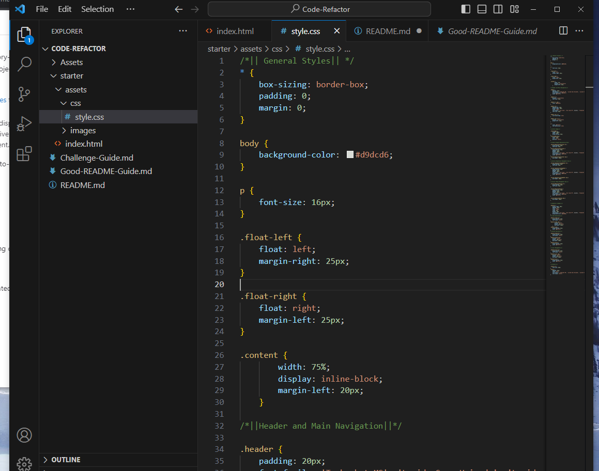
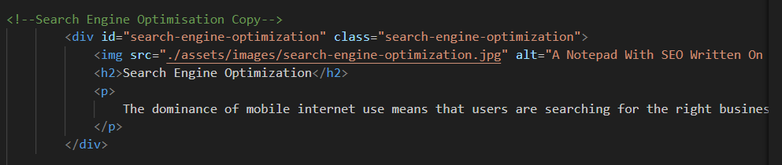

# Code-Refactor
Bootcamp Challenge 1

## Description

A code refactoring project, commissioned by Horiseon, with the aim of improving their website's accessibility, both front-end and back-end, and increasing the site's SEO.

Accomplished this in the following ways

- Add alt text to all images
- Re-organised the CSS, grouping section elements together in a more easily readable fashion.
- Renamed sections of the backend to use more semantic HTML elements.
- Thoroughly labelled both the html and css files with comments for ease of use.
- Fixed broken link 'Search Engine Optimisation' in Nav bar. 

## Link To Application

https://ablam87.github.io/Code-Refactor/

## Installation

N/A

## Usage

All general rules are listed at the top of the CSS, as pictured. Rules for specific elements are grouped beneath, as per page layout.

The ID attribute was missing from the HTML file for this element, meaning that the link didn't cause the page to scroll as intended. This has now been fixed.

## Credit 

Thanks to the good people at the Bootcamp for knocking up the swell starter files x

## License

MIT
